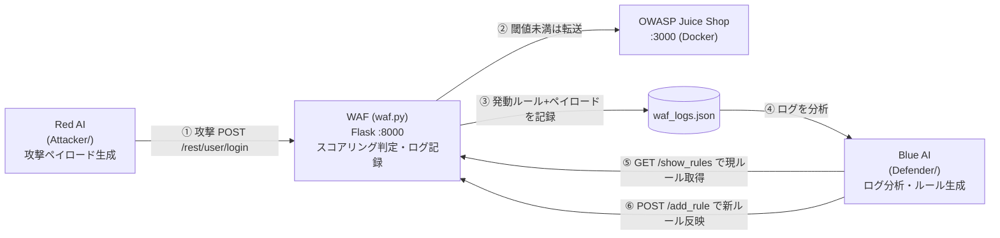

# Original-AI-WAF — 攻撃AI × 防御AI による WAF 自動攻防プロジェクト

Red AI（攻撃側）と Blue AI（防御側）が WAF を挟んで自動で攻防を繰り返し、**防御ルールを AI が自ら育てていく**ことを検証する実験プロジェクトです。攻撃対象は学習用の脆弱アプリ [OWASP Juice Shop](https://owasp.org/www-project-juice-shop/)（ローカル環境）で、SQL インジェクションを題材にしています。

> 個人開発 / 学習・研究目的。「AI で攻撃と防御を自動化したとき、どこまで自動化でき、どこに人の判断が必要になるか」を、自分の手で作りながら確かめることをテーマにしています。

---

## 何をするものか

1. **Red AI** が攻撃ペイロード（ログイン `email` フィールドを狙った SQLi）を生成し、WAF に送信する
2. **WAF** がルールに基づいてスコアを計算し、閾値でブロック/通過を判定。発動ルールとペイロードをログに記録する
3. **Blue AI** が WAF のログを分析し、ブロックできなかった攻撃を防ぐ新しいルールを生成・スコアリングして WAF に反映する
4. 1〜3 を繰り返し、防御ルールが攻撃に合わせて成長していく様子を観察する

## アーキテクチャ

WAF を **リバースプロキシ型**に構成し、攻撃も防御も必ず WAF を経由させています。各コンポーネントは独立したプロセス／HTTP でやり取りします。



### 判定ロジック（`waf.py`）

`email` フィールドを `waf_scoring.json` の各ルール（正規表現 `pattern` + `score`）と照合し、**マッチしたスコアを合算**して段階判定します。単純なブロックリストではなく、複数の弱いシグナルを積み上げて評価する方式です。

| スコア | 判定 | ログのレベル |
| --- | --- | --- |
| `>= 50` | ブロック(403) | critical |
| `>= 35` | ブロック(403) | high-level |
| `>= 20` | 通過するが要注意 | warning |
| `< 20` | 通過 | low-level |

ルールの例（`waf_scoring.json`）:

```json
[
  { "pattern": "'", "score": 10, "name": "single quote", "id": "0001" }
]
```

---

## 主な設計判断と、なぜそう変えたか

このプロジェクトで一番学んだのは「最初の設計が動いても、運用の流れで矛盾が出る」ことでした。以下はコミット履歴に残っている、実際に作り直した判断です。

### 1. WAF を「リバースプロキシ型」に作り直した
当初は簡易的な判定だけの WAF でしたが、実際の防御を模すため **localhost に WAF を立て、攻撃を WAF 経由で Juice Shop に中継する構成**へ変更しました。これにより、攻撃・防御・記録がすべて WAF の一点を通り、ログの追跡性が上がりました。

### 2. 防御 AI に渡すルールを「ファイル直読み」から「WAF への HTTP リクエスト」に変更
防御側の処理を一度抜けると、ファイルから読んだルールが **現在の WAF のルールと食い違う**問題が起きました。スコアリング対象が古いルールになってしまうバグです。
→ Blue AI が参照するルールは常に **`GET /show_rules` で WAF から取得**する形に統一し、状態の一貫性を確保しました。

### 3. 壊れた正規表現で WAF 全体が止まる問題への防御
AI が生成したルールに不正な正規表現が混じると、以降の全リクエストが 500 になり得ます。
→ ルール追加時に **`re.compile` で事前検証**（Pydantic バリデータ）し、不正なルールは弾いて既存ルールを維持。また判定時も 1 ルールの失敗で全体を止めないよう `try/except` で分離しました。

### 4. AI 生成ルールと既存ルールの整合性チェック / ID 採番
生成ルールの ID が既存と衝突しないよう、**既存 ID の最大値 +1 から採番**する処理を追加。AI に任せる部分（ルール文面の生成）と、機械的に担保すべき部分（ID の一意性・整合性）を切り分けました。

### 5. 発動ルールとペイロードを紐づけたログ設計
「どのルールが、どのペイロードに反応したか」を 1 レコードに紐づけて保存。後段の Blue AI が「なぜブロックされた／されなかったか」を分析できるようにしました。

### 6. ローカル LLM / クラウド LLM の切り替え
攻撃ペイロードや防御ルールという機微な情報を扱うため、**ローカル LLM（LM Studio, OpenAI 互換）とクラウド LLM を選択できる**構成にしました。LLM 出力は `instructor` + `Pydantic` で構造化し、通常の JSON モードで失敗したため `MD_JSON` モードを採用しています。

---

## 技術スタック

- **言語**: Python
- **WAF**: Flask
- **LLM 連携**: OpenAI 互換 API（ローカル: LM Studio / クラウド: Groq 等）、`instructor`, `Pydantic`
- **攻撃対象**: OWASP Juice Shop（Docker）
- **構成**: WAF / Red AI / Blue AI / LLM をそれぞれ独立プロセスで起動

## 実行方法

3 つのプロセスを起動してから攻防ループを回します（すべて localhost 前提）。

```bash
# 1. 攻撃対象（Juice Shop, :3000）
docker compose up

# 2. WAF（:8000）
python waf.py

# 3. ローカル LLM（:1234）を LM Studio 等で起動（クラウド利用時は環境変数 Groq_API_KEY を .env に設定）

# 4. 攻防ループ（対話メニュー、"5" で自動攻防ループ）
python main.py
```

## リポジトリ構成

| パス | 役割 |
| --- | --- |
| `waf.py` | WAF 本体。スコアリング判定・ログ記録・ルール検証 |
| `Attacker/` | Red AI。攻撃ペイロード生成、`attack_logs.json` |
| `Defender/` | Blue AI。ログ分析・ルール生成・スコアリング、`waf_logs.json` |
| `main.py` | 攻防ループの起点（対話メニュー） |
| `choice_ai.py` / `ai_model_config.py` | ローカル / クラウド AI とモデルの選択 |
| `challengeAPI.py` | Juice Shop の攻略済みチャレンジ表示、500 が真のサーバエラーか脆弱性発見かの判定 |
| `waf_scoring.json` | ルールとスコアの定義 |

---

## 現状の完成度と今後の課題

学習・検証目的の実験プロジェクトであり、プロダクトとしては未完成です。現時点で認識している課題を正直に記します。

- **攻防ループの自動化は数周のみ**で、「ルールがどこまで攻撃に追従して成長するか」の長期検証はこれから
- ルール一覧の表示が、既存ルールを除いた **生成ルールのみになる**表示上の不具合が残っている
- スコアリングの閾値（35/20/50）は実験的に決めた暫定値で、体系的なチューニングは未実施
- 現状の攻撃対象は **SQLi 中心**。XSS など他カテゴリへの拡張は未着手
- 自動テストが未整備

## 補足（AI 支援の利用について）

一部の実装（ルール整合性チェックの追加など）は AI コーディング支援（Claude Code）を活用しつつ、**「どこを WAF に一元化するか」「ルールを HTTP で取得する形に変えるか」といった設計判断は自分で行いました**。AI を道具として使いながら、設計と意思決定は自分で握ることを意識しています。
